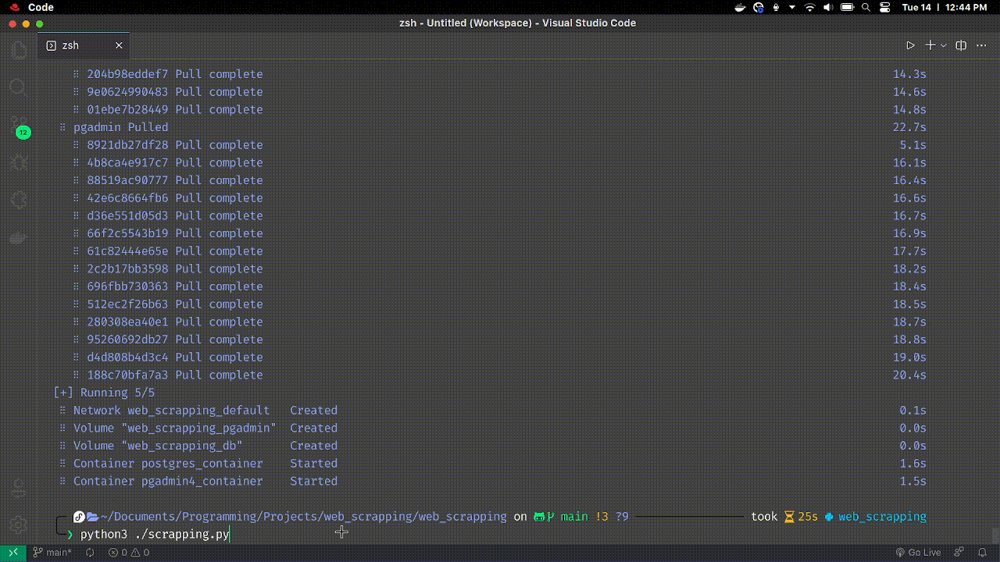

<h1 align="center">
  <br />
  <a href="https://www.canva.com/design/play?category=tACFapY0WQc&referrer=banners-landing-page">
    </a>
</h1>

<p align="center">
  <a href="https://www.python.org/">
    
  </a>
</p>



# How To Use

To clone and run this application, you'll need [Git](https://git-scm.com/downloads), [Python](https://www.python.org/) and [Docker](https://docs.docker.com/get-started/08_using_compose/) installed on your computer. From your command line:

**Clone this repository**

```bash
git clone git@github.com:sammanthaps/web_scrapping.git
```

**Go into the repository**

```bash
cd web_scrapping
```

**Create a virtual enviroment**

```bash
python3 venv env
```

**Activate your virtual enviroment**

```bash
# Linux
source env/bin/activate

# Windows
env\Scripts\activate.bat
```

**Install dependencies**

```bash
pip install -r requirements.txt
```

**Run Docker container**

```bash
docker compose up -d
```

**Run Python script**

```bash
python3 ./scrapping.py
```

**Website used:**

<p align="left">
  <a href="https://www.realtor.ca/">
    
  </a>
</p>
